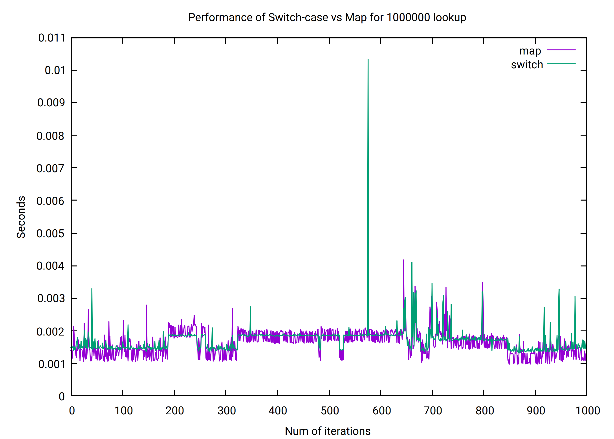
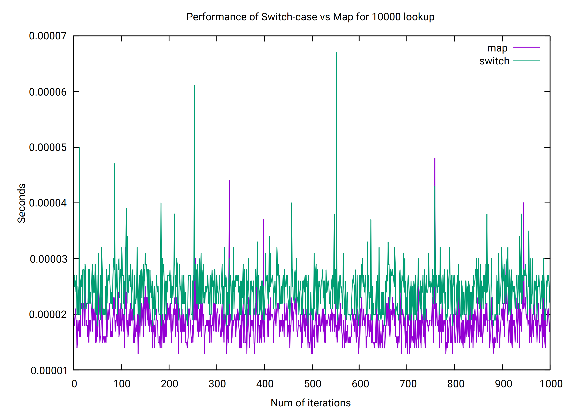

# Without any optimization
```
nirmoy@brihaspati:~/SwitchvsMap> gcc  main.c
nirmoy@brihaspati:~/SwitchvsMap> ./a.out
TESTING data size 1000
0.000004 sec, total time taken by static map conversion
0.000015 sec, total time taken by switch conversion
TESTING data size 10000
0.000051 sec, total time taken by static map conversion
0.000153 sec, total time taken by switch conversion
TESTING data size 100000
0.000599 sec, total time taken by static map conversion
0.001566 sec, total time taken by switch conversion
TESTING data size 1000000
0.003339 sec, total time taken by static map conversion
0.008236 sec, total time taken by switch conversion
```
# with O2 optimization
```
nirmoy@brihaspati:~/SwitchvsMap> gcc  main.c -O2
nirmoy@brihaspati:~/SwitchvsMap> ./a.out
TESTING data size 1000
0.000001 sec, total time taken by static map conversion
0.000001 sec, total time taken by switch conversion
TESTING data size 10000
0.000014 sec, total time taken by static map conversion
0.000019 sec, total time taken by switch conversion
TESTING data size 100000
0.000163 sec, total time taken by static map conversion
0.000157 sec, total time taken by switch conversion
TESTING data size 1000000
0.001176 sec, total time taken by static map conversion
0.001403 sec, total time taken by switch conversion
```




